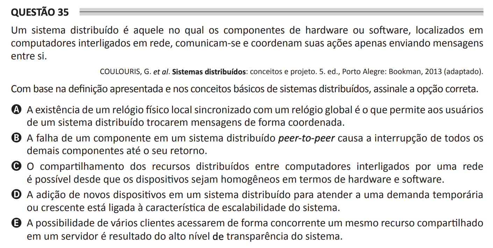

## Question 35 ##

### Original question in image format (in Portuguese): ###

### English translation: ###

**QUESTION 35**

A distributed system is one in which hardware or software components, located on networked computers, communicate and coordinate their actions only by sending messages to each other.

COULOURIS, G. et al. Distributed Systems: Concepts and Design. 5th ed., Porto Alegre: Bookman, 2013 (adapted).

Based on the definition presented and the basic concepts of distributed systems, select the correct option.

A) The existence of a local physical clock synchronized with a global clock is what allows users of a distributed system to exchange messages in a coordinated way.

B) The failure of a component in a peer-to-peer distributed system causes the interruption of all other components until its recovery.

C) The sharing of distributed resources among computers connected by a network is possible as long as the devices are homogeneous in terms of hardware and software.

D) The addition of new devices to a distributed system to meet a temporary or growing demand is linked to the scalability characteristic of the system.

E) The possibility of several clients concurrently accessing the same shared resource on a server is the result of the system's high level of transparency.
